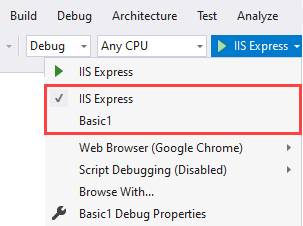

# About

A basic ASP.NET Core 5 Razor page project setup for [Razor Runtime Compilation](https://docs.microsoft.com/en-us/aspnet/core/mvc/views/view-compilation?view=aspnetcore-6.0&tabs=visual-studio).

There are two profiles setup for this project. Run each, once the site is shown in your browser make a change to Pages/index.cshtml (change `Hello World` to say `Hello`), save the file and the displayed page should show the change. 



</br>

### launchSettings.json

```json
{
  "iisSettings": {
    "windowsAuthentication": false,
    "anonymousAuthentication": true,
    "iisExpress": {
      "applicationUrl": "http://localhost:27920",
      "sslPort": 44341
    }
  },
  "profiles": {
    "IIS Express": {
      "commandName": "IISExpress",
      "launchBrowser": true,
      "environmentVariables": {
        "ASPNETCORE_ENVIRONMENT": "Development",
        "ASPNETCORE_HOSTINGSTARTUPASSEMBLIES": "Microsoft.AspNetCore.Mvc.Razor.RuntimeCompilation"
      }
    },
    "Basic1": {
      "commandName": "Project",
      "dotnetRunMessages": "true",
      "launchBrowser": true,
      "applicationUrl": "https://localhost:5001;http://localhost:5000",
      "environmentVariables": {
        "ASPNETCORE_ENVIRONMENT": "Development",
        "ASPNETCORE_HOSTINGSTARTUPASSEMBLIES": "Microsoft.AspNetCore.Mvc.Razor.RuntimeCompilation"
      }
    }
  }
}

```